## Chamberlain Garage Door Remote
Model: 373LM

FCC ID: HBW1573

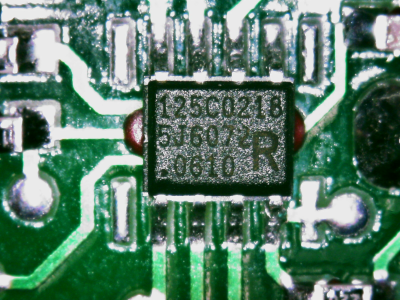

The rolling code chip inside the remote.  I could not find a datasheet.  The FCC report schematic lists this as an Atmel 125C0130 which I could also not find a datasheet one.  These might be made specifically for Chamberlain?

### Signal Capture
Captured the signal with an SDR and opened in inspectrum

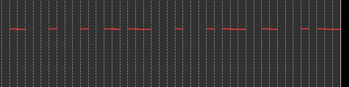

The modulation is OOK.  Initially I thought it might be a PWM encoding, but there seems to be 3 different patterns.  Each division is ~500us.

Low for 1 division and high for 3 divisions.

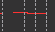

Low for 2 divisions and high for 2 divisions.

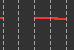

Low for 3 divisions and high for 1 division.

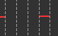

Looked through patents and found one that looks like it matches.

Patent Fig. 6 has the same paterns from the signal capture.

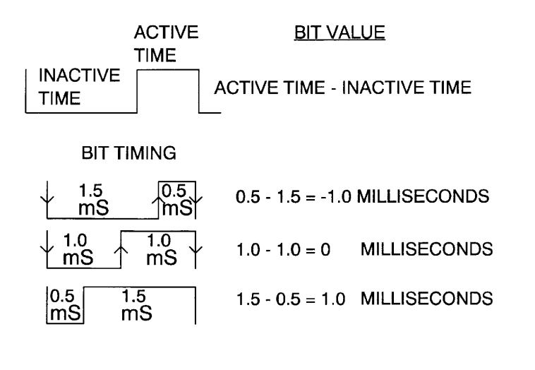

Fig 6. also has the frame layout.

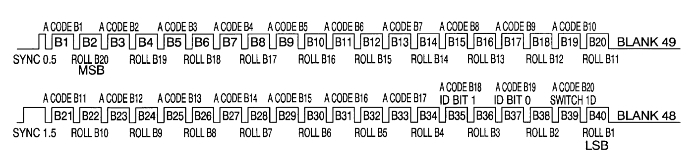

Frame 1 starts with 0.5ms high.  Frame 2 starts with 1.5ms high.  Both frames alternate fixed code and rolling code bits.

Start frame pulses from signal capture match the patent.

Frame 1:

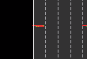

Frame 2:

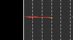

Fig. 6 seems to say that

$\ Bit Value = ActiveTime - InactiveTime$

But in the description of Fig. 6

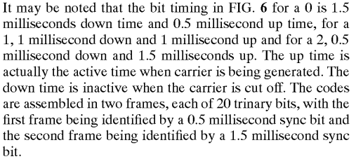

|Active Time|Inactive Time|Difference|Bit Value|
|---|---|---|---|
|0.5ms|1.5ms|-1.0ms|0|
|1.0ms|1.0ms|0.0ms|1|
|1.5ms|0.5ms|1.0ms|2|

Switch ID is B39 in frame 2.

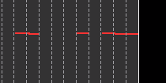

Switch 1 ID is low for 1.5ms and high for 0.5ms which corresponds to 0

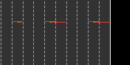

Switch 2 ID is low for 1.0ms and high for 1.0ms which corresponds to 1

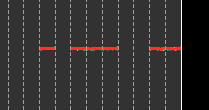

Switch 3 ID is low for 0.5ms and high for 1.5ms which corresponds to 2
